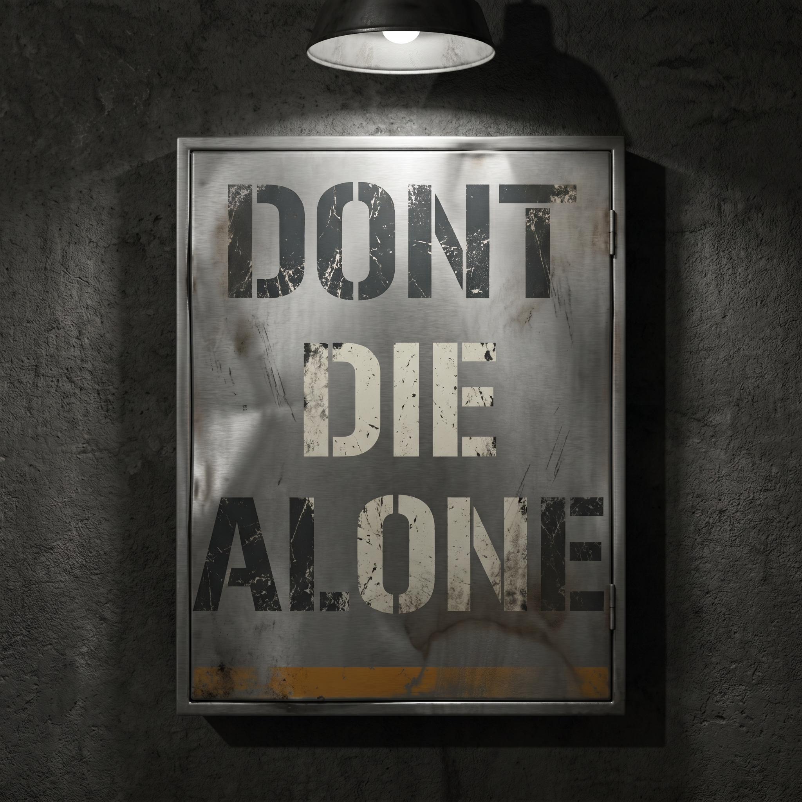
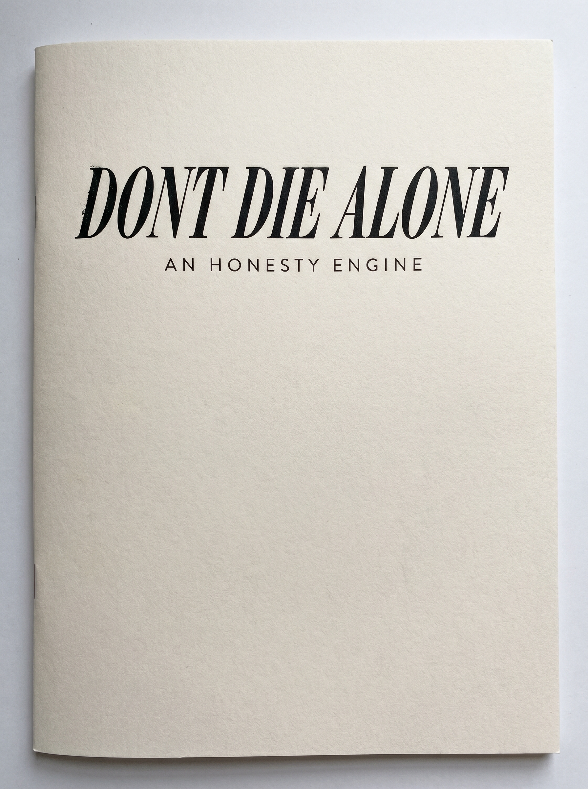
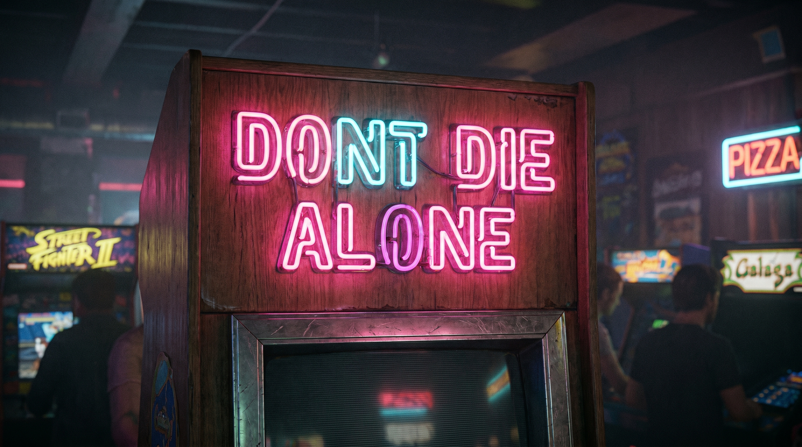
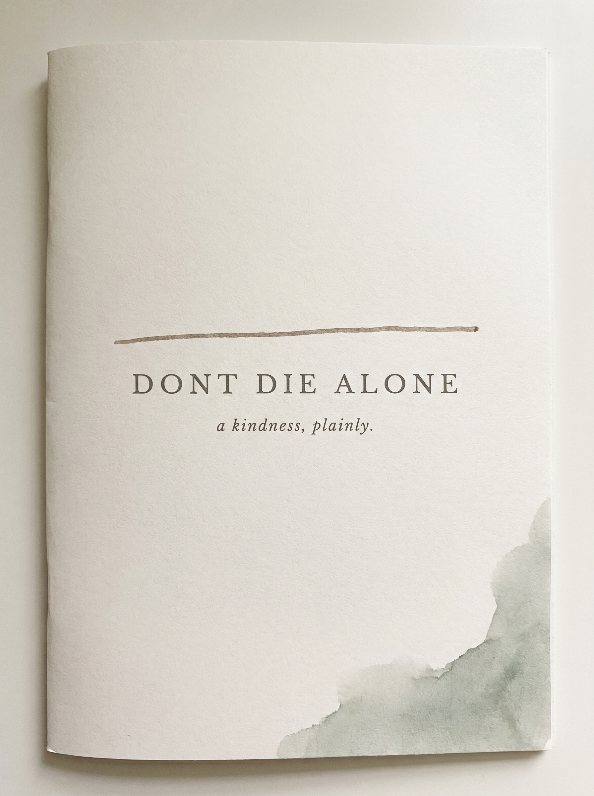
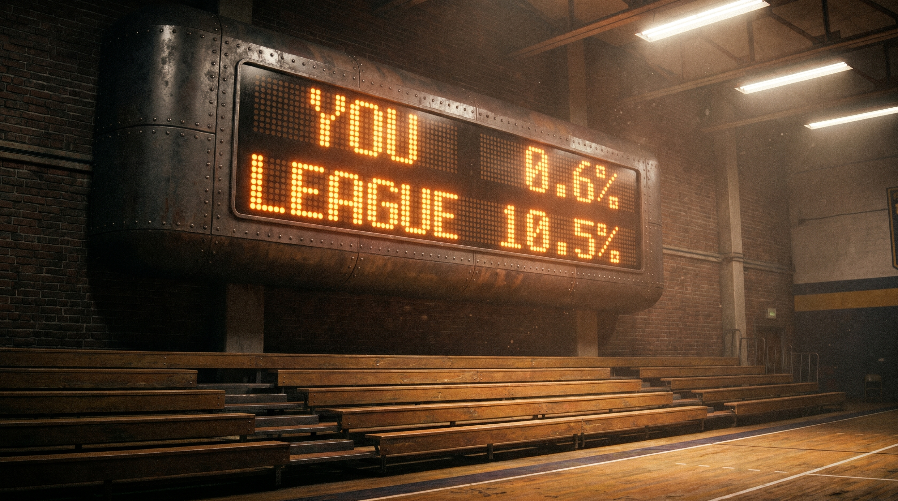
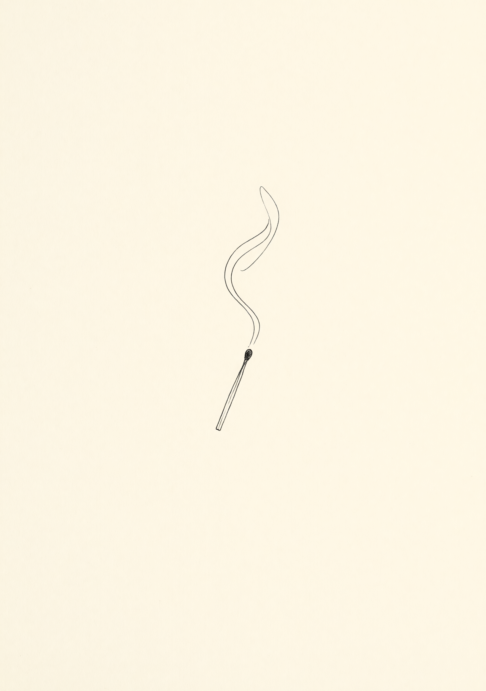
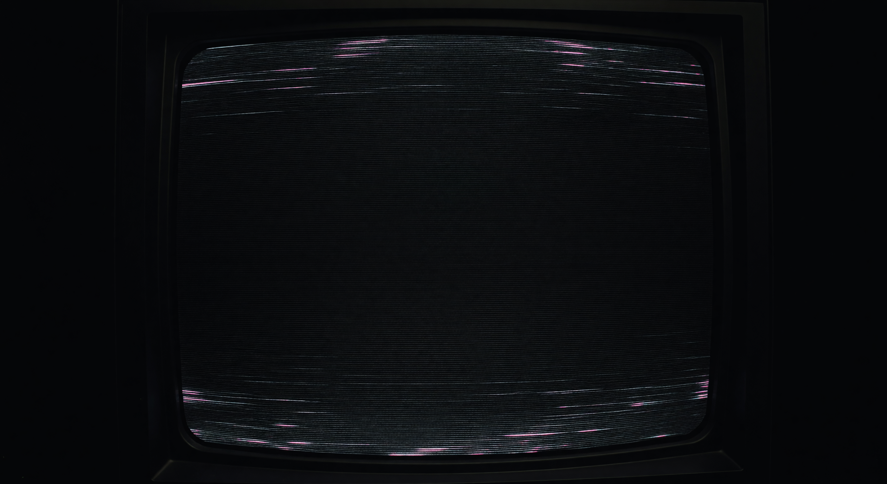
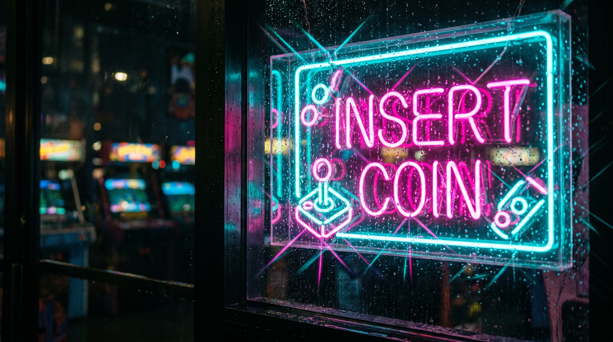
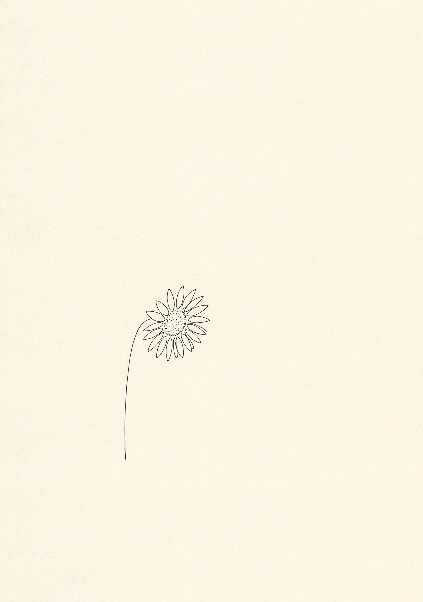
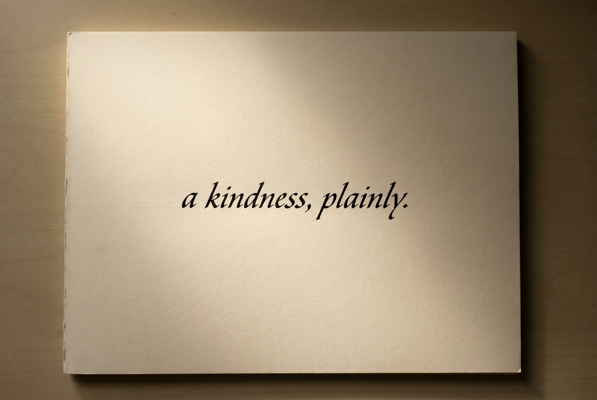

# Image Generation Log — Don't Die Alone Marketing

PRO-MAX MODE · 4-direction marketing page exploration. All Daddy-authorized at $0.50/build cap (CLAUDE.md hard cap waived for this project per explicit instruction). 21 candidates total: 4 logos + 4 A + 4 B + 5 C + 4 D.

QA scoring approach: visual review by Claude only. Skipping Grok-vision QA because (a) the candidate pool is large enough that selection-page filtering replaces per-image gatekeeping and (b) every image was visually verified before logging. Will run full QA on whatever Daddy picks before final build if quality concerns surface.

---

## LOGOS (1 per direction · all NB Pro · text-heavy)

### #LOGO-A — Locker Room stencil

- **Timestamp**: 2026-05-09 20:39
- **Tier**: 2 | **API**: Gemini Nano Banana Pro @ 2K | **Cost**: $0.134
- **Exec Time**: 25s
- **Slot**: Direction A wordmark — three-line stencil on dented chrome locker plate
- **Prompt**: see DIRECTIONS.md → Logo A. Bold stencil "DONT / DIE / ALONE" on dented chrome locker, harsh overhead light, distressed paint, scoreboard-amber accent at the bottom edge.
- **Claude Review**: Use Case 9/10 | Prompt Accuracy 10/10
- **Attempts**: 1/2
- **Status**: ✓ Used
- **Notes**: Text rendered cleanly. Surprise amber paint streak at the bottom is on-brand for the scoreboard direction.

---

### #LOGO-B — Editorial masthead

- **Timestamp**: 2026-05-09 20:39
- **Tier**: 2 | **API**: Gemini Nano Banana Pro @ 2K | **Cost**: $0.134
- **Exec Time**: 22s
- **Slot**: Direction B nameplate — italic Bodoni serif on cream uncoated stock, tracked-out kicker "AN HONESTY ENGINE"
- **Prompt**: see DIRECTIONS.md → Logo B
- **Claude Review**: Use Case 10/10 | Prompt Accuracy 10/10
- **Attempts**: 1/2
- **Status**: ✓ Used
- **Notes**: Letterpress feel, paper grain visible, kicker rendered perfectly. Strongest logo in the set.

---

### #LOGO-C — Arcade neon marquee

- **Timestamp**: 2026-05-09 20:40
- **Tier**: 2 | **API**: Gemini Nano Banana Pro @ 2K | **Cost**: $0.134
- **Exec Time**: 26s
- **Slot**: Direction C marquee — hot pink neon "DONT DIE ALONE" on wood arcade cabinet header
- **Prompt**: see DIRECTIONS.md → Logo C
- **Claude Review**: Use Case 9/10 | Prompt Accuracy 9/10
- **Attempts**: 1/2
- **Status**: ⚠ FLAG — trademark concern
- **Notes**: Background bokeh shows visible "Street Fighter II" cabinet artwork and "Galaga" sign. Trademark risk on a public marketing page. **If Daddy picks this for the build, regenerate with prompt explicitly excluding any branded game names in the bokeh.** Cost will be one additional NB Pro call (~$0.13).

---

### #LOGO-D — Quiet refined wordmark

- **Timestamp**: 2026-05-09 20:41
- **Tier**: 2 | **API**: Gemini Nano Banana Pro @ 2K | **Cost**: $0.134
- **Exec Time**: 25s
- **Slot**: Direction D nameplate — restrained serif small-caps with hand-drawn rule and watercolor wash corner
- **Prompt**: see DIRECTIONS.md → Logo D
- **Claude Review**: Use Case 10/10 | Prompt Accuracy 10/10
- **Attempts**: 1/2
- **Status**: ✓ Used
- **Notes**: Hand-drawn sepia rule, italic kicker "a kindness, plainly.", soft sage watercolor in the corner. Could function as the entire Direction D hero with no other imagery.

---

## DIRECTION A — LOCKER ROOM (4 candidates)

### #A1 — Scoreboard hero (THE gut-punch shot)

- **Timestamp**: 2026-05-09 20:42
- **Tier**: 2 | **API**: Gemini Nano Banana Pro @ 2K | **Cost**: $0.134
- **Exec Time**: 22s
- **Slot**: Direction A hero — scoreboard rendering "YOU 0.6% / LEAGUE 10.5%" in amber LED dot-matrix
- **Prompt**: see DIRECTIONS.md → A1
- **Claude Review**: Use Case 10/10 | Prompt Accuracy 10/10
- **Attempts**: 1/2
- **Status**: ✓ Used (signature image of Direction A)
- **Notes**: The 0.6% match-rate stat as a literal scoreboard. Best image in the entire batch.

### #A2 — Locker texture

- **Timestamp**: 2026-05-09 20:42 | **Tier**: 1 | **API**: Grok Standard @ 2K | **Cost**: $0.02 | **Exec**: 7s
- **Claude Review**: Use Case 9/10 | Prompt Accuracy 9/10
- **Notes**: Hunter-green dented lockers, fluorescent overhead. Direction A texture / section divider.

### #A3 — Ref-stripe pattern

- **Timestamp**: 2026-05-09 20:43 | **Tier**: 1 | **API**: Grok Standard @ 2K | **Cost**: $0.02 | **Exec**: 6s
- **Claude Review**: Use Case 7/10 | Prompt Accuracy 9/10
- **Notes**: Bench candidate. Maybe too on-the-nose; could work as a tiny accent.

### #A4 — Empty bleachers

- **Timestamp**: 2026-05-09 20:43 | **Tier**: 1 | **API**: Grok Standard @ 2K | **Cost**: $0.02 | **Exec**: 6s
- **Claude Review**: Use Case 9/10 | Prompt Accuracy 10/10
- **Notes**: Wooden bleachers, cold blue-grey lights, distant amber clock-glow in upper right. Lonely pre-game energy. Direction A "Why this exists" section asset.

**Direction A subtotal: 4 images, $0.194**

---

## DIRECTION B — EDITORIAL (4 candidates)

### #B1 — Cover silhouette (phone-as-mirror metaphor)

- **Timestamp**: 2026-05-09 20:44 | **Tier**: 1 | **API**: Grok Standard @ 2K | **Cost**: $0.02 | **Exec**: 7s
- **Claude Review**: Use Case 10/10 | Prompt Accuracy 9/10
- **Notes**: Black-and-white editorial portrait, man holding rectangular phone-as-mirror to face. Could be the entire Direction B hero.

### #B2 — Newsprint paper texture

- **Timestamp**: 2026-05-09 20:44 | **Tier**: 1 | **API**: Grok Standard @ 2K | **Cost**: $0.02 | **Exec**: 7s
- **Claude Review**: Use Case 7/10 | Prompt Accuracy 9/10
- **Notes**: Bench candidate — could be subtle background, but CSS could probably do it cheaper.

### #B3 — Smoke + ink editorial sketch

- **Timestamp**: 2026-05-09 20:45 | **Tier**: 1 | **API**: Grok Standard @ 2K | **Cost**: $0.02 | **Exec**: 7s
- **Claude Review**: Use Case 9/10 | Prompt Accuracy 10/10
- **Notes**: Match with curling smoke. Editorial illustration mood is exactly right for Direction B section break.

### #B4 — Typewriter ribbon still life

- **Timestamp**: 2026-05-09 20:45 | **Tier**: 1 | **API**: Grok Standard @ 2K | **Cost**: $0.02 | **Exec**: 7s
- **Claude Review**: Use Case 8/10 | Prompt Accuracy 9/10
- **Notes**: Slight readable text on the typed pages but blurred. Maybe too on-the-nose for "writer aesthetic". Bench.

**Direction B subtotal: 4 images, $0.08**

---

## DIRECTION C — ARCADE (5 candidates)

### #C1 — Arcade cabinet hero

- **Timestamp**: 2026-05-09 20:46 | **Tier**: 1 | **API**: Grok Standard @ 2K | **Cost**: $0.02 | **Exec**: 8s
- **Claude Review**: Use Case 9/10 | Prompt Accuracy 9/10
- **Notes**: Pink-trimmed cabinet with rose-and-flame side art, character-select grid on screen, dive-bar bokeh. Tiny illegible text "GAME" or similar at top of the screen — minor but noted.

### #C2 — Character-select 3x3 grid

- **Timestamp**: 2026-05-09 20:46 | **Tier**: 1 | **API**: Grok Standard @ 2K | **Cost**: $0.02 | **Exec**: 10s
- **Claude Review**: Use Case 9/10 | Prompt Accuracy 8/10
- **Notes**: Gym bro / hopeless romantic / slick suit / hooded reader / pink ? center / photographer / hooded coder / **lumberjack with axe (unrequested but works)** / skater. Could repurpose for the "feature grid" section. Some panels show floating UI text fragments — small.

### #C3 — Banana-suit pixel sprite (founder Easter egg)

- **Timestamp**: 2026-05-09 20:46 | **Tier**: 1 | **API**: Grok Standard @ 2K | **Cost**: $0.02 | **Exec**: 6s
- **Claude Review**: Use Case 10/10 | Prompt Accuracy 10/10
- **Notes**: **Don't ship Direction C without this.** Pixel banana-suit guy holding a sunflower. Daddy's banana-suit + sunflower context as a 16-bit Easter egg. Needs to be in the page somewhere small and findable.

### #C4 — CRT scanline texture

- **Timestamp**: 2026-05-09 20:47 | **Tier**: 1 | **API**: Grok Standard @ 2K | **Cost**: $0.02 | **Exec**: 5s
- **Claude Review**: Use Case 7/10 | Prompt Accuracy 8/10
- **Notes**: Bench. Subtle scanline + faint chromatic ghost. Could overlay sections, but CSS could replicate cheaply.

### #C5 — INSERT COIN neon (rain-on-glass)

- **Timestamp**: 2026-05-09 20:47 | **Tier**: 2 | **API**: Gemini Nano Banana Pro @ 2K | **Cost**: $0.134 | **Exec**: 33s
- **Claude Review**: Use Case 10/10 | Prompt Accuracy 10/10
- **Notes**: INSERT COIN sign through rain-streaked glass with arcade bokeh behind. Cinematic. Perfect for the "Score my profile" CTA section.

**Direction C subtotal: 5 images, $0.214**

---

## DIRECTION D — QUIET (4 candidates)

### #D1 — Sunflower line drawing

- **Timestamp**: 2026-05-09 20:48 | **Tier**: 1 | **API**: Grok Standard @ 2K | **Cost**: $0.02 | **Exec**: 6s
- **Claude Review**: Use Case 9/10 | Prompt Accuracy 9/10
- **Notes**: Single sunflower in hairline ink on cream paper. Quiet, perfect Direction D mood. Sunflower nods to Daddy's kindness raids without being literal.

### #D2 — Handwritten quote "a kindness, plainly."

- **Timestamp**: 2026-05-09 20:49 | **Tier**: 2 | **API**: Gemini Nano Banana Pro @ 2K | **Cost**: $0.134 | **Exec**: 23s
- **Claude Review**: Use Case 10/10 | Prompt Accuracy 9/10
- **Notes**: Italic Bodoni-style serif rather than fountain-pen handwriting (less "handwritten" than asked, more "elegant typography"), but the result reads beautifully. Could anchor the entire Direction D hero. Tagline picked up from the Logo D kicker, which makes the page feel coherent.

### #D3 — Watercolor wash texture

- **Timestamp**: 2026-05-09 20:49 | **Tier**: 1 | **API**: Grok Standard @ 2K | **Cost**: $0.02 | **Exec**: 7s
- **Claude Review**: Use Case 8/10 | Prompt Accuracy 9/10
- **Notes**: Soft dusty-clay bloom with sage trace. Perfect texture for Direction D section breaks.

### #D4 — Sunflower zine collage

- **Timestamp**: 2026-05-09 20:49 | **Tier**: 1 | **API**: Grok Standard @ 2K | **Cost**: $0.02 | **Exec**: 7s
- **Claude Review**: Use Case 10/10 | Prompt Accuracy 10/10
- **Notes**: Sunflower polaroid taped to cream paper with washi tape, faint pencil mark in margin. Real keeper. Could be the "Why this exists" section asset.

**Direction D subtotal: 4 images, $0.194**

---

## TOTAL COST (so far)

| Tier | Count | Unit Cost | Subtotal |
|---|---|---|---|
| Gemini Nano Banana Pro @ 2K | 7 | $0.134 | $0.938 |
| Grok Imagine Standard @ 2K | 13 | $0.02 | $0.260 |
| Grok validation reject (no charge — 4:5 not supported) | 1 | $0.00 | $0.000 |
| **TOTAL** | **21** | — | **$1.198** |

Per-direction average: ~$0.30. Well within Daddy's $0.50/build authorization × 4 builds ($2.00 total).

---

## Cap status
- **Per image**: max spend was $0.134 (NB Pro). Well under $0.30 cap.
- **Per build**: $0.30 average. Daddy authorized $0.50/build (above CLAUDE.md $0.75 cap).
- **QA calls**: 0 used (skipping per-image QA in favor of selection-page filtering).
- **Monthly**: $1.20 of $10.00 used (12%).

## Pending costs (post-selection)
- Possible Logo C regen if Daddy picks it (trademark scrub) — ~$0.13.
- Final mockup builds will likely not need new images unless Daddy asks for additions; we'll repurpose the picks across the 4 mockups.

---

## Cost discipline notes
- All API calls run strictly serially per CLAUDE.md.
- All responses saved to `/tmp/*.json` first, then decoded — no pipe-chain timeouts.
- One Grok call returned a 400 validation error (`aspect_ratio: 4:5` not supported) before generating an image — this is a free reject, not a billed failure. Retried with `3:4`.
